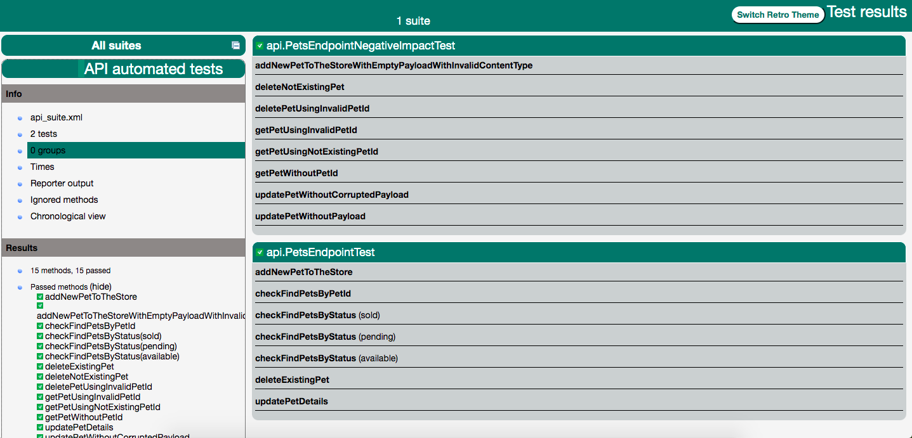
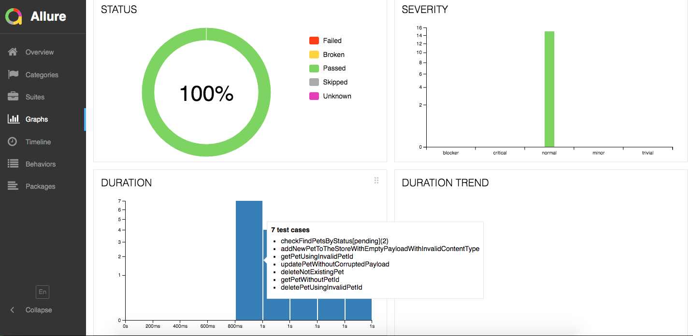

# Testing project - tasks

> This is a documentation for all designed and implemented test tasks.

## How to start

As a first step please checkout project from GitHub repository
available [here](https://github.com/annakapusciak/sampleTestingProjectBP). To do that create some new folder on your
local machine and depends if you're using command console or not you can download project using
this [link](https://github.com/annakapusciak/sampleTestingProjectBP/archive/refs/heads/main.zip) or in command line
paste:

``` 
git clone https://github.com/annakapusciak/sampleTestingProjectBP.git`
```

## 1. Automated test cases for e-commerce site

### Technology

* [Java 11](https://openjdk.java.net/projects/jdk/11/) - programming language
* [Selenium WebDriver](https://www.selenium.dev/) - web browser automation framework
* [WebDriverManager](https://github.com/bonigarcia/webdrivermanager) - to automate the management of the drivers
* [AssertJ](https://joel-costigliola.github.io/assertj/) - fluent assertions library
* [TestNG](https://testng.org/doc/) - test framework to orchestrate tests
* [Surefire report plugin](https://maven.apache.org/surefire/maven-surefire-report-plugin/) - test report tool
* [Allure Report](https://docs.qameta.io/allure/) - test report tool (alternative)
* [Lombok](https://projectlombok.org/) - java library to automates building object creations and logging

### Test scenarios

Below is the list of test cases which were covered by automated tests. All tests can be found
under [src/test/java/web](src/test/java/web).

### 1. Home page and search results page - [HomePageTest.java](src/test/java/web/HomePageTest.java)

- Check load of home page - `web.HomePageTest.homePageLoadedCorrectly`
- Check navigation to search result page - `web.HomePageTest.navigateToSearchResults`
- Check searching for any existing item(s) - `web.HomePageTest.searchForAnyExistingItem`
- Check searching for any not existing item - `web.HomePageTest.searchForAnyNotExistingItem`
- Check empty cart - `web.HomePageTest.checkEmptyCart`

### 2. Login page - [LoginPageTest.java](src/test/java/web/LoginPageTest.java)

- Check navigation to login page - `web.LoginPageTest.navigateToLoginPage`
- Check login required Captcha using any credentials - `web.LoginPageTest.checkLoginUsingAnyCredentialsRequiresCaptcha`

> **Note:**
>
> * App behaviour is not deterministic because in major login attempts page requires Captcha but for some reason sometimes Captcha step is ommited. Because of that `LoginPageTest.checkLoginUsingAnyCredentialsRequiresCaptcha` can fail from time to time.
> * Successful log in was not implemented in automated tests because it requires [reCAPTCHA](https://www.google.com/recaptcha/about/). As a result of that, it's also not possible to test automatically logout. Both cases can be covered by manual tests described in Manual Tests section.

### 3. New account creation page - [NewAccountCreationTest.java](src/test/java/web/NewAccountCreationTest.java)

- Check navigation to new account creation page - `web.NewAccountCreationTest.navigateToNewAccountCreationPage`
- Check login required Captcha using any credentials
    - `web.NewAccountCreationTest.checkNewAccountCreationRequiresCaptcha`

> **Note:**
>
> * App behaviour is not deterministic because in major new account creation attempts page requires Captcha but for some reason sometimes Captcha step is ommited. Because of that `NewAccountCreationTest.checkNewAccountCreationRequiresCaptcha` can fail from time to time.
>
> * Successful new account creation was not implemented in automated tests because it requires [reCAPTCHA](https://www.google.com/recaptcha/about/).

### 4. Checkout flow - [CheckoutTest.java](src/test/java/web/CheckoutTest.java)

- Check navigation to search result page - web.CheckoutTest.navigateToProductPage
- Check adding products to the cart - web.CheckoutTest.checkAddProductToTheCart
- Checkout cart is ready for payment - web.CheckoutTest.checkoutCartIsReadyForPayment

### Running tests

UI tests can be run in three ways:

#### 1. GitHub CI tool

#### 2. From command line

[maven](https://maven.apache.org/) needs to be installed on local machine. Dedicated default maven profile
called `UI_tests` was created to execute all created web tests.

To run all tests put in command line below line and click enter:

```
mvn clean -PUI_tests test
```

To run single test from `src/test/java/web` package use:

```
mvn clean -Dtest=<put_here_name_of_the_test_class> -PUI_tests test
```

Sample for [HomePageTest](src/test/java/web/HomePageTest.java) test:

```
mvn clean -Dtest=HomePageTest -PUI_tests test
```

To run group of selected tests from `src/test/java/web` package use:

```
mvn clean -Dtest=<put_here_name_of_the_test_class> -PUI_tests test
```

Tests by default take parameters predefined in [src/test/resources/web.properties](src/test/resources/web.properties)
file but test can be parametrized using:

```
mvn clean -DuserEmail=<put_email_here> -DuserPassword=<put_password_here> -Dbrowser=chrome -Dtimeout=<put_timeout_number_in_seconds> -PUI_tests test
```

#### 3. From any IDE

Tests can be run from any IDE like i.e. [IntelliJ IDEA](https://www.jetbrains.com/idea/). Then each `*Test.java` class
from `src/test/java/web` package can be run using `run` option after clicking right mouse button on class name.

## Reporting

### Surefire report

Default reporting solution generates as a result of running tests from maven. Report available
under [target/surefire-reports/index.html](target/surefire-reports/index.html).

Sample report:


### Allure report

This is an alternative option to generate more interactive report. Please follow instructions on Allure
page [here](https://docs.qameta.io/allure/). Before launching Allure report you must run tests to generate surefire
report as in Surefire report above step.

Sample report:


## Manual tests

1. Successful login using valid credentials.

   Preconditions: valid credentials
    1. Go to login page and provide valid credentials (available
       in [src/test/resources/web.properties](src/test/resources/web.properties)). Click on Sign in button.
    2. On the next site with reCAPTCHA check visible checkbox and select pictures as instructed.
    3. Click on Submit button.
    4. User should be successfully logged into account, where site presents user details - First and Last Name, history
       of orders.

1. Successful logout. (defect found here, reported in Found defects section

   Preconditions: user is logged in
    1. Click on logout button on account page.
    2. User was successfully logged out and redirected to the login page.

### Found defects

Summary: Logout is broken - unable to logout from the site

Priority: High

Creating date: 06/30/2021, 5:13 EST

Region: production

Description:

- Actual: After clicking on Logout button on My Account page user is not logged out and redirected to 404 - not existing
  page (screenshot attached)
- Expected: After clicking on Logout button on My Account page user should be successfully logged out and redirected to
  the login page.
- Workaround: To close the session and logout user needs to close browser using which was logged into the page.
- Steps to reproduce: Login using valid credentials and once successfully signed in click on Logout button on My Account
  page.

Attachments: screen

## 2. Automated tests for a REST API service

### Technology

[RestAssured](https://rest-assured.io/) - library to support REST API services testing

### Postman

[Postman](https://www.postman.com/) script which can be executed to run all prepared tests can be found
as [src/test/resources/REST API tests.postman_collection.json](src/test/resources/REST API tests.postman_collection.json)
.

### Configuration

Tests by default take parameters predefined in [src/test/resources/api.properties](src/test/resources/api.properties).
Default REST service to test is documented on [https://petstore.swagger.io/](https://petstore.swagger.io/).

### Valid scenarios - [api.PetsEndpointTest](src/test/java/api/PetsEndpointTest.java)

- Check pets by status - `api.PetsEndpointTest.checkFindPetsByStatus`
- Add new pet to store - `api.PetsEndpointTest.addNewPetToTheStore`
- Get created pet details - `api.PetsEndpointTest.checkFindPetsByPetId`
- Update pet details - `api.PetsEndpointTest.updatePetDetails`
- Delete existing pet - `api.PetsEndpointTest.deleteExistingPet`

### Negative impact scenarios - [api.PetsEndpointNegativeImpactTest](src/test/java/api/PetsEndpointNegativeImpactTest.java)

- Try to delete not existing pet - returns 404 - `api.PetsEndpointNegativeImpactTest.deleteNotExistingPet`
- Try to delete pet with invalid id - returns 400 - `api.PetsEndpointNegativeImpactTest.deletePetUsingInvalidPetId`
- Try to add new pet to the store (with empty json payload) - returns 415
    - `api.PetsEndpointNegativeImpactTest.addNewPetToTheStoreWithEmptyPayloadWithInvalidContentType`
- Try to get created pet details with invalid id - returns 404
    - `api.PetsEndpointNegativeImpactTest.getPetUsingInvalidPetId`
- Try to get created pet details (without id) - returns 405 - `api.PetsEndpointNegativeImpactTest.getPetWithoutPetId`
- Try to get created pet details with not existing id - returns 404
    - `api.PetsEndpointNegativeImpactTest.getPetUsingNotExistingPetId`
- Try to update pet (without json payload) - returns 415 - `api.PetsEndpointNegativeImpactTest.updatePetWithoutPayload`
- Try to update pet (with corrupted json payload) - returns 500
    - `api.PetsEndpointNegativeImpactTest.updatePetWithoutCorruptedPayload`

### Running tests

UI tests can be run in three ways:

#### 1. From command line

[maven](https://maven.apache.org/) needs to be installed on local machine. Dedicated default maven profile
called `API_tests` was created to execute all created web tests.

To run all tests put in command line below line and click enter:

```
mvn clean -PAPI_tests test
```

To run single test from `src/test/java/api` package use:

```
mvn clean -Dtest=<put_here_name_of_the_test_class> -PAPI_tests test
```

Sample for [PetsEndpointTest](src/test/java/api/PetsEndpointTest.java) test:

```
mvn clean -Dtest=PetsEndpointTest -PAPI_tests test
```

#### 2. From any IDE

Tests can be run from any IDE like i.e. [IntelliJ IDEA](https://www.jetbrains.com/idea/). Then each `*Test.java` class
from `src/test/java/web` package can be run using `run` option after clicking right mouse button on class name.

## Reporting

### Surefire report

Default reporting solution generates as a result of running tests from maven. Report available
under [target/surefire-reports/index.html](target/surefire-reports/index.html).

Sample report:


### Allure report

This is an alternative option to generate more interactive report. Please follow instructions on Allure
page [here](https://docs.qameta.io/allure/). Before launching Allure report you must run tests to generate surefire
report as in Surefire report above step.

Sample report:


## 3. Load test

Implemented in separate project available as GitHub
project [https://github.com/annakapusciak/loadTestsTask](https://github.com/annakapusciak/loadTestsTask).

## 4. SQL query task

All queries needed to implement this task was included in [queries.sql](src/test/resources/queries.sql) script. It
contains:

- creation of ```users``` table with columns ```(id, email, citizenship_country_id)```
- creation of ```countries``` table with columns ```(id, name, iso)```
- single query which returns result with scenario show to all countries with more than 1000 users, sorted by user count.
  The country with the most users should be at the top.
